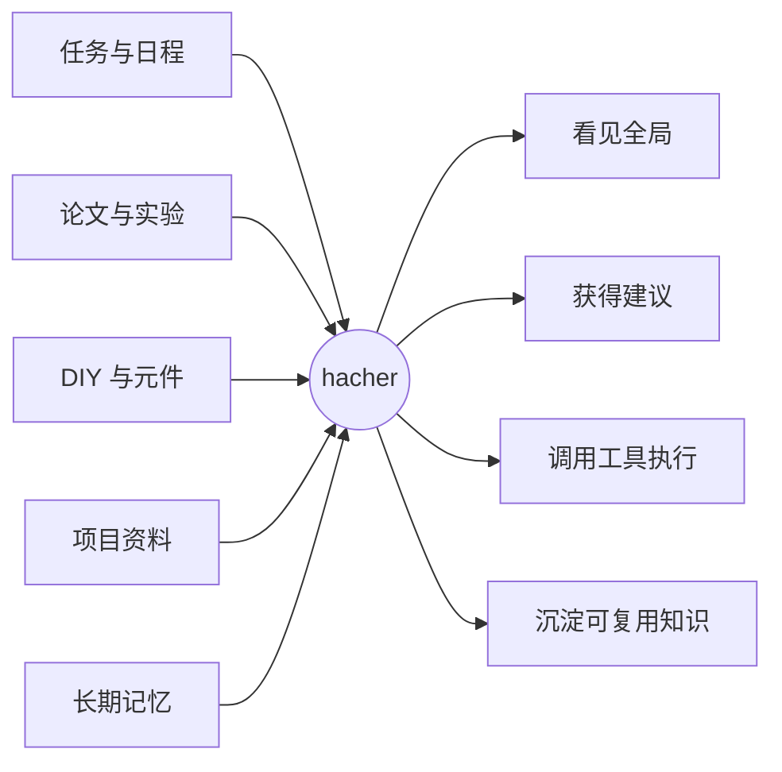
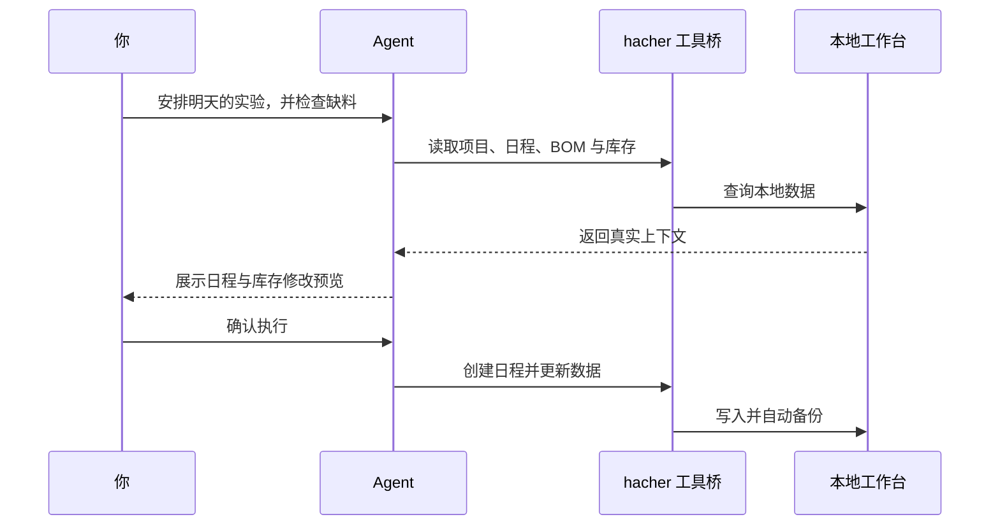
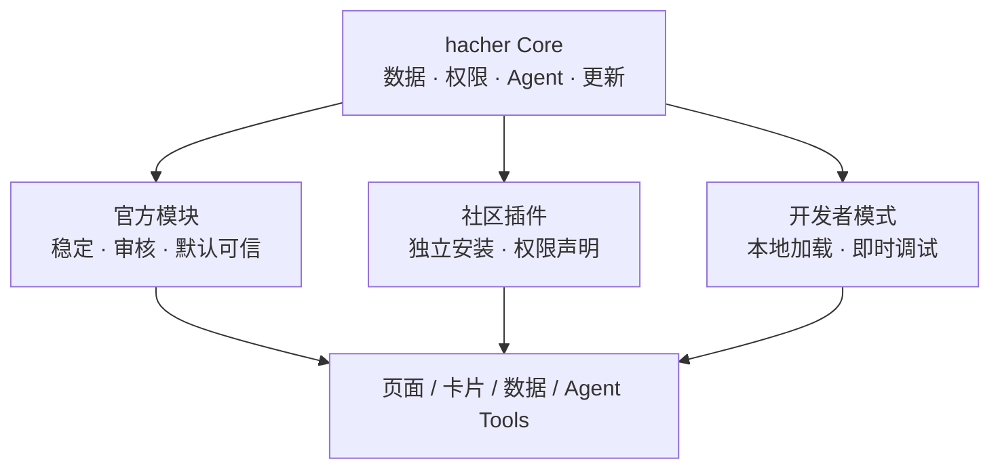

<div align="center">
  

  # hacher

  **为科研、创造与个人项目打造的本地智能工作台**

  *One workspace. Real context. Actions, not just answers.*

  [](https://github.com/Jackjiang665/hacher/releases/latest)
  
  
  

  [下载最新版](https://github.com/Jackjiang665/hacher/releases/latest) · [功能地图](#功能地图) · [设计理念](#不只是功能集合) · [更新日志](./CHANGELOG.md) · [从源码运行](#从源码运行)
</div>

---

## 把散落的事情，变成一个可以被理解的系统

研究生要读论文、做实验，创业者要推进产品，创作者还会画电路板、写软件、管理零件和记录突然出现的想法。问题往往不是缺少工具，而是信息散落在太多工具里——AI 也因此看不见完整上下文。

**hacher 希望成为人与项目之间的智能工作层：**任务、日程、论文、实验、文件、库存和长期记忆聚集在同一个本地工作台里，再由 Agent 理解它们、连接它们，并在获得授权后真正完成操作。



> hacher 不是想再做一个聊天框，而是让 AI 拥有可靠的上下文、明确的工具和可确认的执行过程。

## 不只是功能集合

| 理念 | hacher 的选择 |
|:---:|:---|
| 🧠 **上下文先于对话** | AI 可以理解项目、任务、库存和记忆，而不是每次从零开始聊天。 |
| ⚡ **行动胜于回答** | Agent 通过受控工具读取和更新工作台；涉及写入时，先预览，再由人确认。 |
| 🏠 **本地优先** | 核心数据、论文和项目资料默认保存在自己的电脑上，升级不会主动清除数据。 |
| 🧩 **万物皆可扩展** | 长期方向是把页面、自动化和 Agent 工具沉淀成模块，让不同开发者创造自己的工作流。 |
| 🔗 **信息必须相连** | 论文属于研究项目，日程承载任务，BOM 对照库存；数据不是一座座孤岛。 |
| 🌱 **从个人工具长成平台** | 先解决真实需求，再逐步开放插件协议、开发者模式与社区生态。 |

## 功能地图

| 领域 | 能做什么 |
|:---|:---|
| 🏡 **工作台总览** | 汇总今日任务、近期日程、项目进展与库存提醒。 |
| ✅ **任务与日程** | 管理待办和周时间轴，支持时间区间、分类、编辑、删除与冲突提示。 |
| 🧪 **项目中心** | 组织任务、日程、论文、文件、日志、BOM、里程碑、风险与方案决策。 |
| 📚 **论文与科研** | 管理本地 PDF，去重、打开和删除论文，并实时检索 arXiv。 |
| 🌍 **每日情报** | 关注研究主题，聚合最新论文与可追溯网页资料，生成晨间简报。 |
| 🔧 **电子元件库** | 批量识别购买截图，合并同类元件，管理数量、核对状态与低库存提醒。 |
| 🗣️ **英语学习** | 创建学习计划、记录每日投入并统计累计时长。 |
| 🧠 **Agent 记忆** | 手动维护长期记忆，让本地 Agent 在后续任务中持续理解你的偏好与方向。 |
| `>_` **Agent 终端** | 在应用内运行 PowerShell 和 Claude Code，并通过数据桥连接真实工作台。 |
| 🚀 **软件内更新** | 检查 GitHub 最新版本、查看说明、下载进度，并由用户确认重启安装。 |

<details>
<summary><strong>看看几条已经跑通的真实工作流</strong></summary>

### 从购买截图到元件仓库

一次选择多张截图 → AI 提取名称、规格、分类和数量 → 跳过重复图片 → 合并同名同规格元件 → 低置信度条目标记为待核对。

### 从研究主题到每日情报

添加关注主题 → arXiv 与网页资料检索 → 保留题目、作者、摘要、日期和来源链接 → 每日更新或手动刷新 → 汇入主页简报。

### 从项目资料到可追踪进展

为项目保存或关联原始文件 → 记录工作日志 → 连接任务、日程与论文 → 用 BOM 对照元件库存 → 沉淀里程碑、问题与决策时间线。

</details>

## AI 如何参与工作



应用内的 Claude Agent 通过受控数据桥读取任务、库存、项目、日程、论文、关注主题和长期记忆。写入命令默认只生成预览，确认后才执行；数据变化会同步回界面。

后台千问服务负责截图识别、检索词生成和情报整理，与 Claude Agent 的长期记忆相互隔离。

## 未来：让工作台由插件生长

hacher 目前仍以完整桌面应用的方式发布，插件 SDK **尚未开放**。未来希望将侧边栏页面、工作台卡片、数据类型、定时任务和 Agent Tools 都变成可扩展能力。



我们期待两种创造方式共存：优秀模块经审核进入正式发行版；开发者也可以在明确权限与风险提示下，自主加载和体验实验性功能。

### 路线图

- [x] 本地工作台与真实数据持久化
- [x] 项目、论文、日程、库存之间的关联
- [x] AI 截图入库与每日情报
- [x] Agent 终端、长期记忆与受控数据桥
- [x] 用户确认的软件内更新
- [ ] 稳定的模块边界与插件协议
- [ ] 本地插件加载、权限系统与安全模式
- [ ] Agent Tool SDK 与开发者文档
- [ ] 经审核的社区插件分发
- [ ] 账号、云同步与移动端

## 下载与安装

前往 [GitHub Releases](https://github.com/Jackjiang665/hacher/releases/latest) 下载最新的 `hacher-setup-*.exe`。

- 当前提供 **Windows x64** 安装版。
- 安装程序可以选择目录，并创建桌面和开始菜单快捷方式。
- 从 v1.4.0 起，可在“我的工作区 → 版本与更新”中主动检查更新。
- hacher 不会未经确认自动下载或安装新版本。
- 当前安装包尚未进行商业代码签名，Windows SmartScreen 可能显示“未知发布者”。

## 配置后台智能服务

截图识别、检索词生成和每日情报使用用户自己的阿里云百炼 API Key：

1. 在阿里云百炼控制台创建 API Key；
2. 打开 hacher 左下角“我的工作区”右侧的三点菜单；
3. 进入“后台智能服务”，填写 API Key 和模型名称。

支持 `sk-` 与新版 `sk-ws-` API Key。Key 仅保存在当前 Windows 用户的本机配置中，不会写入 GitHub 仓库或工作台数据文件。

## 数据与隐私

| 数据 | 本地位置 |
|:---|:---|
| 工作台数据 | `%APPDATA%\hacher-workbench\hacher-data.json` |
| 本地论文 | `%APPDATA%\hacher-workbench\papers\` |
| 项目资料 | `%APPDATA%\hacher-workbench\projects\` |
| 自动备份 | `%APPDATA%\hacher-workbench\backups\` |

- 任务、项目、库存与记忆默认仅保存在本机。
- 升级或卸载应用不会主动删除工作台数据。
- 使用截图识别、检索和情报整理时，完成请求所需的内容会发送至用户配置的阿里云百炼服务。

## 从源码运行

需要 Node.js 18+、Git 和 Windows。

```bash
git clone https://github.com/Jackjiang665/hacher.git
cd hacher
npm install --ignore-scripts
node tools/prepare-native.cjs
npm start
```

打包 Windows 安装程序：

```bash
npm run pack
```

技术栈：Electron · xterm.js · node-pty · 阿里云百炼 / 千问 · arXiv API · electron-builder

## 当前边界

- 暂不支持账号、云同步、移动端和多人协作。
- PDF 论文库尚未自动解析全文或生成结构化笔记。
- Excel/供应商级 BOM 导入仍在规划中。
- Claude 终端需要本机另外安装并登录 Claude Code。
- 插件架构是明确的演进方向，但尚未开放安装第三方插件。

## License

`UNLICENSED` — 当前为个人项目，仅供学习与交流。插件 SDK 与社区贡献规则将在开放生态前另行确定。

---

<div align="center">
  <strong>让 AI 不只了解你说了什么，也了解你正在做什么。</strong>
  <br><br>
  如果你也在寻找一种更连贯的科研与创造方式，欢迎试用、反馈和共同塑造 hacher。
</div>
